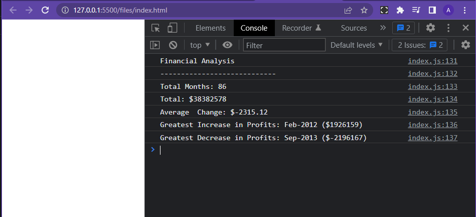

# Console Finances

## Description

Console Finances is a website that parses an array of financial records to calculate the increase/ decreases in profit, average change and total profit.

## Installation

No installation necessary! However an internet browser is required and Google Chrome is reccomended. Link to website is:https://amarmalde.github.io/Console_Finances/

You will also need to display the console to access the information by right clicking, clicking on inspect and then console on the top right. Information in the console should match tConsole Financeshe screenshot(./images/website_screenshot.PNG) below.

